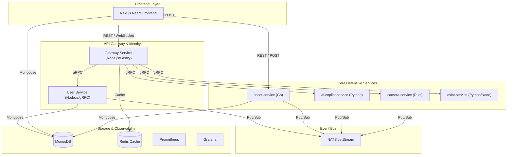
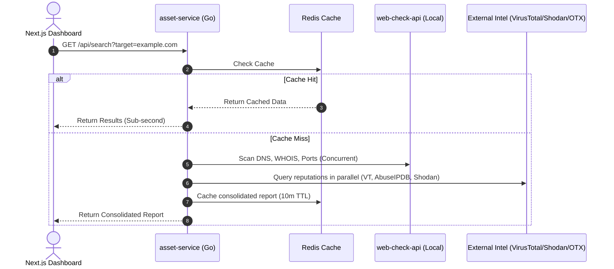
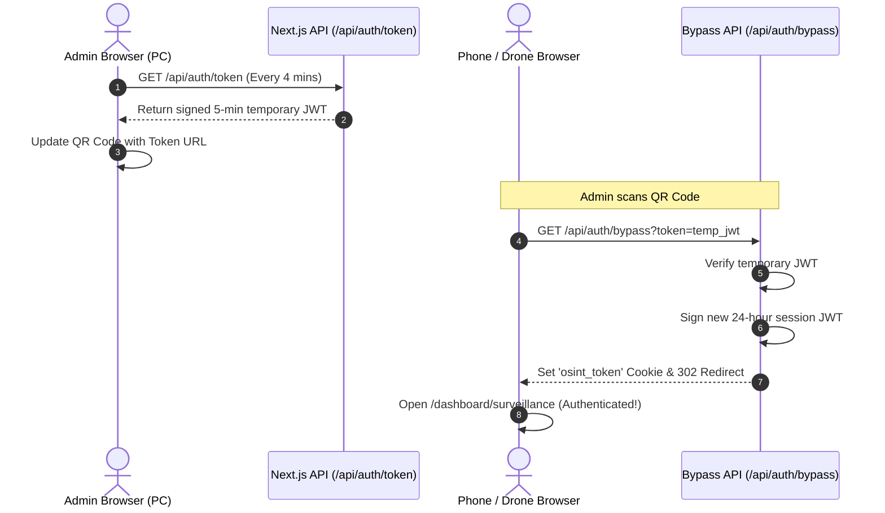

<div align="center">
  
  <h1 align="center">Kaal Bhairav OSINT & Security Operations Platform</h1>
  <p align="center">
    <strong>Production-Grade Open Source Intelligence, Cyber Threat Hunting, & Surveillance Platform</strong>
  </p>
  <p>
    <a href="#overview">Overview</a> •
    <a href="#key-features">Key Features</a> •
    <a href="#system-architecture">Architecture</a> •
    <a href="#technology-stack">Tech Stack</a> •
    <a href="#module-breakdown">Modules</a> •
    <a href="#surveillance--pairing">Surveillance & Pairing</a> •
    <a href="#installation--setup">Setup</a>
  </p>
</div>

---

## 📖 Overview

**Kaal Bhairav** is an industry-grade, highly scalable, and modular web application designed for Cyber Threat Intelligence (CTI), Open Source Intelligence (OSINT) gathering, network link analysis, and live surveillance monitoring. 

It provides SOC analysts, threat hunters, and cyber-intelligence professionals with a unified interface to monitor targets, analyze threat intelligence feeds, map out malicious network infrastructures, and view real-time CCTV streams. Moving beyond a standard monolithic architecture, Kaal Bhairav employs a **Polyglot Event-Driven Microservices** architecture for extreme performance, flexibility, and scalability—making it comparable to enterprise solutions like CrowdStrike Falcon or Elastic Security.

---

## ✨ Key Features

- **🕸️ OSINT & Web-Check Integration:** Transparently integrated intelligence aggregation combining `web-check-api` (local network deployment) alongside crt.sh, Shodan, VirusTotal, AbuseIPDB, and AlienVault OTX with low-latency parallel fan-out queries and sub-second caching.
- **🎥 Live Camera Intelligence Module:** Real-time CCTV streaming with multi-camera WebRTC/RTSP support, object/motion detection powered by a highly concurrent Rust processing engine.
- **📱 Zero-Friction QR Pairing:** Connect mobile devices or drone streams directly to active camera feeds with zero credential entry required via pre-authenticated, auto-refreshing bypass tokens.
- **🌐 Global Access Tunneling:** Integrated automated network discovery and localtunnel proxies to allow remote pairing across separate networks or cellular connections.
- **🗺️ Advanced Threat Mapping (GIS):** Professional threat intelligence maps utilizing MapLibre and Leaflet to visualize active incidents, malware campaigns, and asset telemetry.
- **🤖 AI Security Copilot:** A multi-LLM (OpenAI, Claude, Llama) abstraction layer capable of interpreting threat data, summarizing investigations, and guiding incident response workflows via natural language.
- **🔌 Pluggable Architecture:** A robust plugin manager designed to dynamically load external scanners, recon modules, and custom visualization tools without modifying the core system.
- **🛡️ Live Threat Feed Connectors:** Ingest normalized indicators of compromise (IOCs) from MITRE ATT&CK, CVE/NVD, AbuseIPDB, MISP, and AlienVault OTX.
- **🔒 Zero-Trust Security Model:** Implements stringent Role-Based Access Control (RBAC), stateless JWT authentication, and secure inter-service gRPC communication.

---

## 🏗️ System Architecture

Kaal Bhairav has been modernized into a distributed, event-driven polyglot microservice ecosystem to handle the immense throughput of intelligence gathering and stream processing.

### High-Level Topology



### 1. API Gateway (Node.js / Fastify)
Acts as the ingress point. It translates standard REST and WebSocket requests from the frontend into highly optimized synchronous **gRPC** calls to the backend microservices. Handles robust rate limiting (to prevent brute force/DDoS attacks), global authentication decoding, Redis caching for heavy workloads (like AI analysis), and WebSocket hub routing.

### 2. Message Broker (NATS JetStream)
Facates asynchronous, event-driven communication across the platform. Handles massive broadcast events like `scan.completed`, `ioc.matched`, or `camera.motion_detected` enabling the microservices to remain deeply decoupled and independently scalable.

### 3. Polyglot Microservices
Each service is built using the most appropriate language for its domain:
- **Rust (`camera-service`)**: Handles CPU-intensive tasks like video stream decoding (FFmpeg/GStreamer), OpenCV processing, and bounding-box drawing with minimal latency.
- **Go (`asset-service`)**: High-performance HTTP service handling live threat intelligence aggregation. Runs concurrent fan-out routines to check against local `web-check-api` and external intelligence providers (VirusTotal, AbuseIPDB, AlienVault OTX, Shodan, crt.sh). Gracefully degrades if providers are offline or api keys are missing. Performs sub-second category-specific caching using **Redis**.
- **Python (`ai-copilot-service`)**: Leverages the rich AI/ML and data-science ecosystems for language models, anomaly detection, and intelligence feed parsing. Compiles protobuf specs at build time for optimal start-up times.
- **Node.js (`user-service`, `gateway`)**: Manages identity, RBAC, session management, and orchestrates frontend requests.

### 4. gRPC Communication Specifications
All core microservices communicate over HTTP/2 using gRPC interfaces defined in the `/proto` directory:
* **`UserService` (`user.proto`)**: Exposes `Authenticate` and `ValidateToken` endpoints. The Fastify API Gateway utilizes this service to exchange and sign tokens.
* **`CameraService` (`camera.proto`)**: Exposes RTSP stream configurations, camera listings, stream frame coordinates, and analytics status.
* **`AICopilotService` (`ai_copilot.proto`)**: Handles threat logic and queries via `AnalyzeThreat`.

### 5. NATS JetStream Event Stream Topology
The services utilize NATS JetStream as an asynchronous event message broker to process events concurrently:
* **`auth.login_event`**: Published by the API Gateway when a user logs in. Subscribed to by security logging microservices to audit access.
* **`camera.motion_detected`**: Published by the Rust `camera-service` when motion is detected in real-time streams. The Next.js server listens to this topic and pushes SSE (Server-Sent Events) notifications to active security monitors.
* **`threat.ioc_matched`**: Published by the Go `asset-service` when a high-reputation threat vector or malicious IP is matched during threat hunting.

### 6. Dynamic OSINT Threat Hunting Flow
When an analyst searches for a target IP or domain:


---

## 📱 Surveillance & Pairing Mechanics

To support mobile surveillance displays, field monitoring, and drone telemetry overlays, the platform provides a **Stream Pairing** utility.

### Auto-Discovered Network Ingress
- **LAN Routing:** The platform automatically queries its active network adapters (WLAN, Ethernet, Wi-Fi) on startup via `/api/host-ip` to fetch your computer's local IP address (e.g. `192.168.100.128`), bypassing loopback (`localhost`) issues on external devices.
- **Global Tunneling:** To support connections from separate networks or cellular connections, a built-in public proxy agent (`scripts/start-tunnel.js`) generates secure external links (using **Tunnelmole** with a fallback to **Localtunnel** e.g., `https://*.tunnelmole.net`) without locking configuration files.

### Token-Based Zero-Friction Login
Scanning the generated QR code logs external devices in instantly:
1. **Dynamic Bypass Token:** The platform signs a short-lived (5-minute expiration) temporary token for the authenticated user.
2. **Auto-Refresh Loop:** To prevent code timeouts on active monitors, the client automatically requests a fresh token every 4 minutes.
3. **Bypass Verification (`/api/auth/bypass`):** When scanned, the device requests the bypass handler. The server validates the temporary token, generates a persistent 24-hour cookie, and drops it on the phone before redirecting directly to the CCTV feeds.

#### Authentication Bypass Flow


---

## 🛠️ Technology Stack

### Frontend
- **Framework:** Next.js 16 (App Router) + React 19
- **State Management:** Zustand, @tanstack/react-query
- **Styling & Animation:** Tailwind CSS v4, Framer Motion
- **Visuals:** Recharts, React-Leaflet, AG Grid

### Backend
- **Gateway:** Fastify (Node.js)
- **Service Interfaces:** Protocol Buffers (`.proto`) and gRPC
- **Microservices:** Rust (Tonic), Go (net/http + go-redis), Python (grpcio)

### Infrastructure & Data
- **Message Broker:** NATS JetStream
- **Databases:** MongoDB (Primary Data), Redis (Caching & Sessions)
- **Containerization:** Docker & Docker Compose
- **Routing Protection:** Next.js 16 Network Proxy (`proxy.ts`)

---

## 📂 Repository Structure

```text
advanced-mern-osint-application/
├── src/                    # Next.js Frontend App & REST API Routes
│   ├── app/                # App Router pages and network proxy configurations
│   │   ├── api/            # API Route Handlers
│   │   │   ├── auth/       # Authentication Gateway Endpoints
│   │   │   │   ├── bypass/ # QR code login bypass redirection
│   │   │   │   ├── login/  # Primary credential login validation
│   │   │   │   └── token/  # Ephemeral pairing token generators
│   │   │   ├── host-ip/    # Dynamic network interface adaptors scanner
│   │   │   └── surveillance/ # Camera streams and SSE telemetry pushes
│   │   ├── dashboard/      # Protected dashboard views (surveillance, maps, search)
│   │   ├── layout.tsx      # Global HTML configuration
│   │   └── page.tsx        # Entry login landing component
│   ├── components/         # Premium React visual component overlays
│   │   └── dashboard/      # Interactive dashboard tabs (CCTV frames, threat charts)
│   ├── db/                 # Database connection templates and schemas
│   ├── lib/                # Shared encryption, JWT, and helper utilities
│   ├── proxy.ts            # Next.js 16 Network request boundary & gatekeeper
│   └── globals.css         # Custom CSS theme with glassmorphic variables
├── gateway/                # Fastify API Gateway (gRPC proxy layer)
├── user-service/           # Identity Management & RBAC Service (gRPC/Node)
├── asset-service/          # Threat Intel Aggregator Service (Go/Redis)
├── camera-service/         # CCTV RTSP stream frame analyzer (Rust/Tonic)
├── ai-copilot-service/     # Chat copilot interface (Python/LLM integration)
├── proto/                  # Protobuf contract definitions for inter-service communication
├── scripts/                # Utility shell scripts and server operations tools
│   └── start-tunnel.js     # Public network exposure daemon
├── docker-compose.yml      # Orchestration system
└── README.md               # User & Architecture Manual
```

---

## ⚙️ Prerequisites

To run this platform locally for development, you will need:
- **Node.js** `v20.x` or higher
- **NPM** `v10.x` or higher
- **Docker Engine & Docker Compose** (Critical for standing up NATS, Redis, MongoDB, and polyglot containers)
- *(Optional)* **Rust Toolchain**, **Go 1.24+**, and **Python 3.11+** if you intend to run the microservices natively outside of Docker.

---

## 🚀 Installation & Setup

### 1. Clone & Install Dependencies
Clone the repository and install the frontend/utility dependencies:
```bash
git clone https://github.com/gl1tch0x1/kaal-bhairav.git
cd kaal-bhairav
npm install
```

### 2. Environment Configuration
Create a `.env` file in the root of the project:
```env
# Database Connections
MONGODB_URI=mongodb://127.0.0.1:27017/osint
REDIS_URL=redis://127.0.0.1:6379

# Gateway & NATS
GATEWAY_PORT=4000
NATS_URL=nats://127.0.0.1:4222

# Security
JWT_SECRET=super_secret_jwt_key_kaal_bhairav_2026

# External OSINT Provider API Keys (Optional)
SHODAN_API_KEY=
VT_API_KEY=
ABUSEIPDB_API_KEY=
OTX_API_KEY=
```

### 3. Expose Server Globally (Optional)
If you want to allow external mobile phones/drones on separate networks to pair with the server, run the tunnel manager in a separate terminal (this uses **Tunnelmole** to expose the port, falling back to **Localtunnel** if needed):
```bash
node scripts/start-tunnel.js
```
This writes the public HTTPS address to `tunnel.txt` which the platform picks up automatically to generate remote QR links.

### 4. Spin Up Core Infrastructure
Use Docker Compose to build and start the entire stack (Microservices, Gateway, NATS, Redis, MongoDB).
```bash
docker compose build
docker compose up -d
```
*Note: The first build will take some time as it compiles the Go, Rust, and Python stubs inside their respective containers.*

### 5. Start the Frontend Application
Run the Next.js development server (configured to listen on network port `3001` and bind to all interfaces `0.0.0.0`):
```bash
npm run dev
```

The UI will be accessible at `http://localhost:3001` (or your computer's LAN IP). The frontend will communicate directly with the API Gateway running on port `4000`.

---

## 🔒 Security Hardening & Zero-Trust Architecture

To safeguard threat intelligence, CCTV surveillance streams, and user access records, Kaal Bhairav implements a comprehensive **Zero-Trust & Hardened Security Model**:

### 1. Inter-Service gRPC Authentication (mTLS / Shared Secrets)
To prevent unauthorized containers on the network from accessing or tampering with internal microservices, all internal gRPC calls (Node API Gateway → User / Camera / AI services) enforce metadata signature checks.
- **Shared Secret Signature:** The API Gateway injects a `Bearer <JWT_SECRET>` header into the outbound gRPC metadata.
- **Microservice Enforcement:** The **Node.js User Service**, **Python AI Copilot Service**, and **Rust Camera Service** inspect incoming metadata headers. Any request lacking a valid matching signature is rejected with a `Status.UNAUTHENTICATED` error code.

### 2. API Gateway Ingress Authorization
Protected HTTP endpoints on the Fastify API Gateway (`port 4000`) are secured against unauthenticated access:
- **Auth Hook:** The `/api/camera/:id/stream` and `/api/ai/analyze` routes utilize a Fastify `preHandler` hook.
- **Token Verification:** The hook extracts the token from the `Authorization: Bearer <token>` header or `osint_token` cookie and calls `userClient.ValidateToken` to check session validity. Unauthenticated requests are rejected with `401 Unauthorized` before reaching microservices.

### 3. Safe Administrative User Seeding
Default admin credentials (`admin`/`admin`) are seeded securely:
- **One-time Seed:** Seeding occurs safely once during MongoDB initialization if no admin user is present.
- **Backdoor Removal:** Removed legacy logic that reset the administrator's password back to the default `admin` hash upon check-failure. Administrative passwords, once changed by the user in settings, remain immutable.

### 4. Hardened Cookie Policy
- Enforces `httpOnly: true`, environment-aware `secure: true` (activated under production environments or active Tunnelmole/Localtunnel HTTPS proxy URLs), and `sameSite: "lax"` to support mobile cross-site redirection and drone telemetry streams safely.

---

## 📅 Roadmap & Evolution

- [x] **Phase 1:** Core Infrastructure (gRPC, NATS, Microservice Stubs, API Gateway)
- [x] **Phase 2:** OSINT & Web-Check Native Integration (Go aggregation engine)
- [x] **Phase 3:** Real-Time Camera Intelligence (RTSP/WebRTC + Rust Object Detection)
- [x] **Phase 4:** Threat Intelligence Connectors & Background Schedulers (AbuseIPDB, OTX, VT)
- [x] **Phase 5:** Automated Remote QR Pairing & Network Tunnel Integration
- [ ] **Phase 6:** Production Hardening & Observability (OpenTelemetry, Signal-handling)

---

## 📝 License

This project is intended for educational, demonstrative, and defensive security purposes. Users are strictly responsible for adhering to applicable laws and regulations when using OSINT and scanning tools against external infrastructure.

<p align="center">Developed with 💻 & ☕ for the Cyber Intelligence Community.</p>
