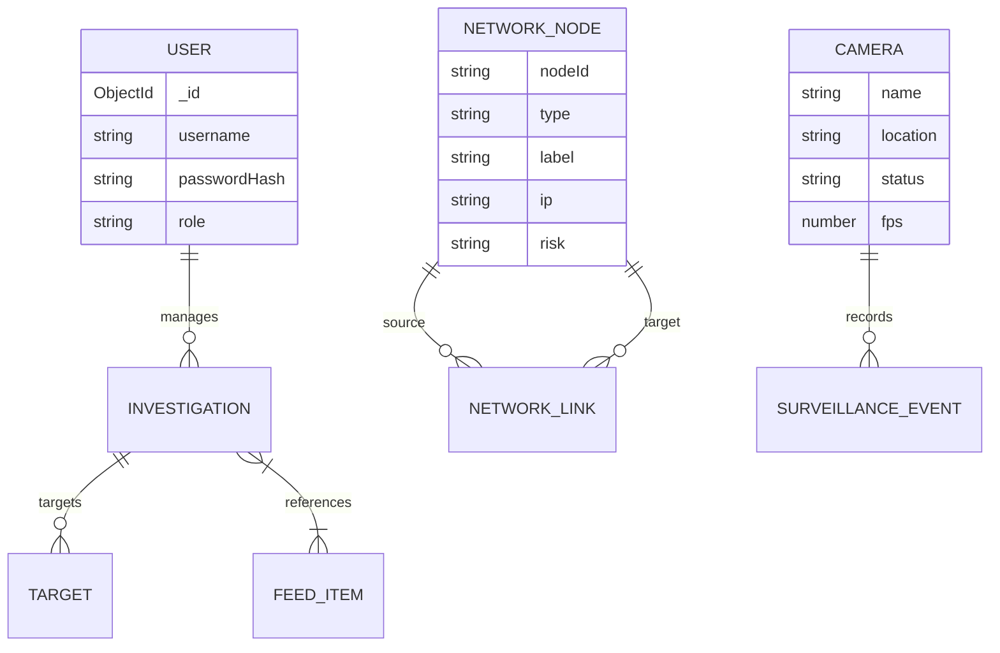

<div align="center">
  
  <h1 align="center">Kaal Bhairav OSINT Platform</h1>
  <p align="center">
    <strong>Advanced MERN-based Open Source Intelligence & Surveillance Dashboard</strong>
  </p>
</div>

---

## 📖 Overview

Kaal Bhairav is an industry-grade, highly optimized, and modern web application designed for Open Source Intelligence (OSINT) gathering, network link analysis, and live surveillance monitoring. 

It provides cyber-intelligence analysts with a unified interface to monitor targets, analyze threat intelligence feeds, map out malicious network infrastructures, and view simulated live CCTV surveillance streams—all powered by a fast, dynamic Next.js frontend and a resilient MongoDB backend.

---

## ✨ Key Features

- **🛡️ Live Threat Feed:** Real-time stream of parsed Indicators of Compromise (IOCs) such as malicious IPs, domains, and phishing campaigns.
- **🕸️ Network Topology Mapping:** Interactive, force-directed graph rendering interconnected nodes (targets, IPs, domains) for link analysis.
- **🎥 Live Surveillance Module:** Simulated CCTV management console with live polling of detection logs, camera connection telemetry, and active threat events.
- **🎯 Target Management:** Track and monitor specific individuals or infrastructure targets with calculated risk scores and status updates.
- **🔍 OSINT Search Engine:** Comprehensive search interface simulating queries across multiple external intelligence databases.
- **🚀 Ultra-Optimized Architecture:** Built with React `useMemo`, lazy-loaded components (`next/dynamic`), and custom skeleton UI loaders for maximum performance.
- **🔒 Secure Authentication:** Private, authenticated access utilizing secure session management (default `admin` / `admin`).

---

## 🏗️ System Architecture

The application follows a modernized MERN (MongoDB, Express/API routes, React, Node.js) architecture integrated tightly within the Next.js 14+ App Router framework.

```mermaid
graph TD
    subgraph Client [Frontend UI Client - Browser]
        UI[Next.js React Frontend]
        AuthC[Auth Context]
        Components[Lazy Loaded Components]
        UI --> AuthC
        UI --> Components
    end

    subgraph API [Next.js API Routes - Backend]
        Router[/api/* Endpoints]
        Auth[Auth Controller]
        Search[Search Service]
        Surveillance[Surveillance Polling]
        DataFeeds[Data Feed Handlers]
    end

    subgraph Database [MongoDB - Persistence]
        DB[(MongoDB Local)]
        Users[Users Collection]
        Investigations[Investigations Collection]
        Feeds[FeedItems Collection]
        Nodes[Network Nodes & Links]
        Cameras[Cameras & Events]
    end

    %% Flow
    Client -- HTTP GET/POST --> Router
    Router --> Auth
    Router --> Search
    Router --> Surveillance
    Router --> DataFeeds

    Auth -- Mongoose --> Users
    Search -- Mongoose --> Investigations
    DataFeeds -- Mongoose --> Feeds
    Surveillance -- Mongoose --> Cameras
    DataFeeds -- Mongoose --> Nodes
    
    style Client fill:#0f172a,stroke:#38bdf8,stroke-width:2px,color:#fff
    style API fill:#0f172a,stroke:#10b981,stroke-width:2px,color:#fff
    style Database fill:#0f172a,stroke:#f59e0b,stroke-width:2px,color:#fff
```

### 🗄️ Database Schema Topology



---

## 🛠️ Technology Stack

- **Frontend Framework:** [Next.js](https://nextjs.org/) (React, App Router)
- **Styling:** Tailwind CSS & Lucide Icons (Glassmorphism & modern dark aesthetics)
- **Data Visualization:** Recharts (Analytical Charts), React-Force-Graph-2D (Network Mapping)
- **Backend Environment:** Node.js API Routes (Next.js serverless functions)
- **Database:** MongoDB & Mongoose ORM
- **Authentication:** Custom session-based JWT authentication

---

## ⚙️ Prerequisites

Before you begin, ensure you have the following installed on your machine:
- **Node.js:** `v18.x` or higher
- **NPM:** `v9.x` or higher
- **MongoDB:** A running local MongoDB instance (`mongodb://127.0.0.1:27017`) or a MongoDB Atlas cluster.

---

## 🚀 Installation & Setup

1. **Clone the repository:**
   ```bash
   git clone <repository-url>
   cd advanced-mern-osint-application
   ```

2. **Install dependencies:**
   ```bash
   npm install
   ```

3. **Configure Environment Variables:**
   Create a `.env` file in the root directory and add the following:
   ```env
   # Database Connection
   MONGODB_URI=mongodb://127.0.0.1:27017/osint

   # JWT Secret for Session Management
   JWT_SECRET=super_secret_jwt_key_kaal_bhairav_2026
   ```

4. **Seed the Database:**
   Populate the database with the initial mock intelligence data, network nodes, and the default admin user.
   ```bash
   npm run seed
   ```

5. **Start the Development Server:**
   ```bash
   npm run dev
   ```

6. **Access the Application:**
   Open your browser and navigate to `http://localhost:3000`.

---

## 🔐 Default Credentials

After running the seeder, the system is provisioned with a default administrator account. Registration has been intentionally disabled for security purposes.

- **Username:** `admin`
- **Password:** `admin`

*Note: You can update your password from the settings dashboard after logging in.*

---

## 📱 Module Overview

| Module | Description |
| :--- | :--- |
| **Dashboard** | High-level intelligence overview, metric cards, and timeline charts. |
| **OSINT Search** | Comprehensive lookup tool simulating scans against 50+ global databases. |
| **Investigations** | Track ongoing and past investigations. |
| **Target Analysis** | Detailed profiling of tracked individuals and digital infrastructure. |
| **Network Map** | Force-directed interactive graphing for tracking relational dependencies. |
| **Live Surveillance** | Simulated CCTV console showing active event streams and telemetry. |
| **Intelligence Feed** | Aggregated global threat indicators and alerts. |

---

## 📝 License

This project is intended for educational and demonstrative purposes in building advanced intelligence dashboards.

<p align="center">Developed with 💻 & ☕ for the Cyber Intelligence Community.</p>
