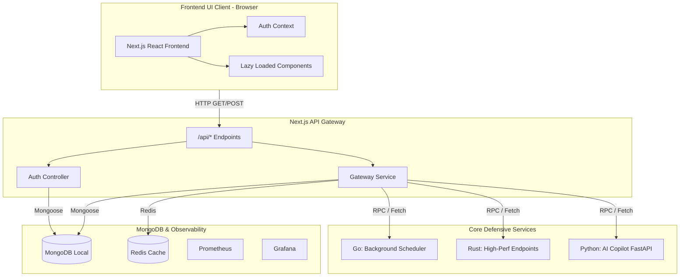
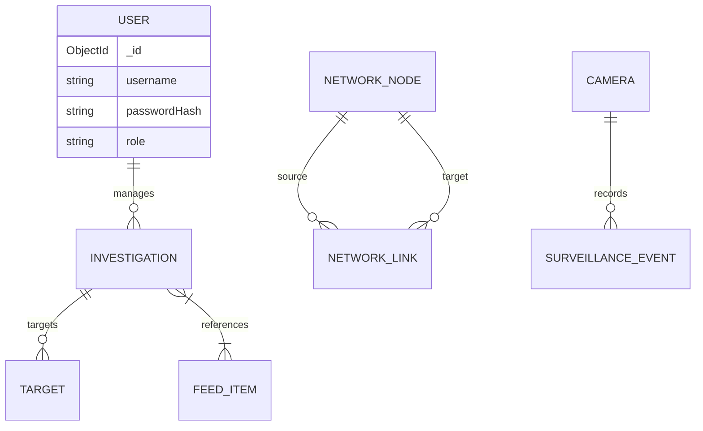

<div align="center">
  <h1 align="center">🌎 Kaal Bhairav OSINT Platform</h1>
  <p align="center">
    <strong>Advanced MERN-based Open Source Intelligence & Surveillance Dashboard</strong>
  </p>
</div>

---

## 📖 Overview

Kaal Bhairav is an industry-grade, highly optimized, and modern web application designed for Open Source Intelligence (OSINT) gathering, network link analysis, and live surveillance monitoring. 

It provides cyber-intelligence analysts with a unified interface to monitor targets, analyze threat intelligence feeds, map out malicious network infrastructures, and view simulated live CCTV surveillance streams—all powered by a fast, dynamic Next.js frontend and a resilient MongoDB backend.

---

## ✨ Key Features

- **🛡️ Live Threat Feed:** Real-time stream of parsed Indicators of Compromise (IOCs) such as malicious IPs, domains, and phishing campaigns (Supported by MITRE & CVE Feed Integrations).
- **🕸️ Network Topology Mapping:** Advanced Geographic Information System (GIS) mapping powered by Leaflet and MapLibre for precise threat localization.
- **🎥 Live Surveillance Module:** Simulated CCTV management console with live polling of detection logs, camera connection telemetry, and active threat events.
- **🎯 Target Management:** Track and monitor specific individuals or infrastructure targets with calculated risk scores and status updates.
- **🔍 OSINT Search Engine:** Comprehensive search interface simulating queries across multiple external intelligence databases.
- **🚀 Ultra-Optimized Architecture:** Built with React `useMemo`, `Zustand` global state, `@tanstack/react-query`, and `framer-motion` animations.
- **⚙️ Polyglot Microservices:** Highly-scalable distributed architecture incorporating high-performance Rust, Go, and Python stubs behind an API Gateway.
- **🔒 Security & Observability:** Secure session management (JWT), combined with Prometheus & Grafana for distributed telemetry and structured JSON logging.

---

## 🏗️ System Architecture

The application transitioned from a MERN monolith to a distributed Polyglot Microservice architecture.



### 🗄️ Database Schema Topology



---

## 🛠️ Technology Stack

- **Frontend Framework:** [Next.js](https://nextjs.org/) (React, App Router)
- **State Management:** Zustand, @tanstack/react-query
- **Styling:** Tailwind CSS, Framer Motion, Lucide Icons
- **Data Visualization:** Recharts (Analytical Charts), React-Leaflet (GIS Mapping)
- **Microservices:** Rust (warp), Go, Python (FastAPI)
- **Backend API Gateway:** Node.js (Next.js serverless functions)
- **Database & Cache:** MongoDB & Mongoose ORM, Redis
- **Observability:** Prometheus, Grafana, Structured JSON Logger
- **Authentication:** Custom session-based JWT authentication

---

## ⚙️ Prerequisites

Before you begin, ensure you have the following installed on your machine:
- **Node.js:** `v18.x` or higher
- **NPM:** `v9.x` or higher
- **Docker & Docker Compose:** Required to run MongoDB, Redis, Prometheus, and Grafana simultaneously.

---

## 🚀 Installation & Setup

1. **Clone the repository:**
   ```bash
   git clone <repository-url>
   cd advanced-mern-osint-application
   ```

2. **Install dependencies:**
   ```bash
   npm install
   ```

3. **Configure Environment Variables:**
   Create a `.env` file in the root directory and add the following:
   ```env
   # Database Connection
   MONGODB_URI=mongodb://127.0.0.1:27017/osint

   # JWT Secret for Session Management
   JWT_SECRET=super_secret_jwt_key_kaal_bhairav_2026
   ```

4. **Boot up Core Infrastructure:**
   Run Docker Compose to spin up MongoDB, Redis, Prometheus, and Grafana:
   ```bash
   docker-compose up -d
   ```

5. **Seed the Database:**
   Populate the database with the initial mock intelligence data, network nodes, and the default admin user.
   ```bash
   npm run seed
   ```

6. **Start the Development Server:**
   ```bash
   npm run dev
   ```

7. **Access the Application:**
   Open your browser and navigate to `http://localhost:3000`.

---

## 🔐 Default Credentials

After running the seeder, the system is provisioned with a default administrator account. Registration has been intentionally disabled for security purposes.

- **Username:** `admin`
- **Password:** `admin`

*Note: You can update your password from the settings dashboard after logging in.*

---

## 📱 Module Overview

| Module | Description |
| :--- | :--- |
| **Dashboard** | High-level intelligence overview, metric cards, and timeline charts. |
| **OSINT Search** | Comprehensive lookup tool simulating scans against 50+ global databases. |
| **Investigations** | Track ongoing and past investigations. |
| **Target Analysis** | Detailed profiling of tracked individuals and digital infrastructure. |
| **Network Map** | Force-directed interactive graphing for tracking relational dependencies. |
| **Live Surveillance** | Simulated CCTV console showing active event streams and telemetry. |
| **Intelligence Feed** | Aggregated global threat indicators and alerts. |

---

## 📝 License

This project is intended for educational and demonstrative purposes in building advanced intelligence dashboards.

<p align="center">Developed with 💻 & ☕ for the Cyber Intelligence Community.</p>
